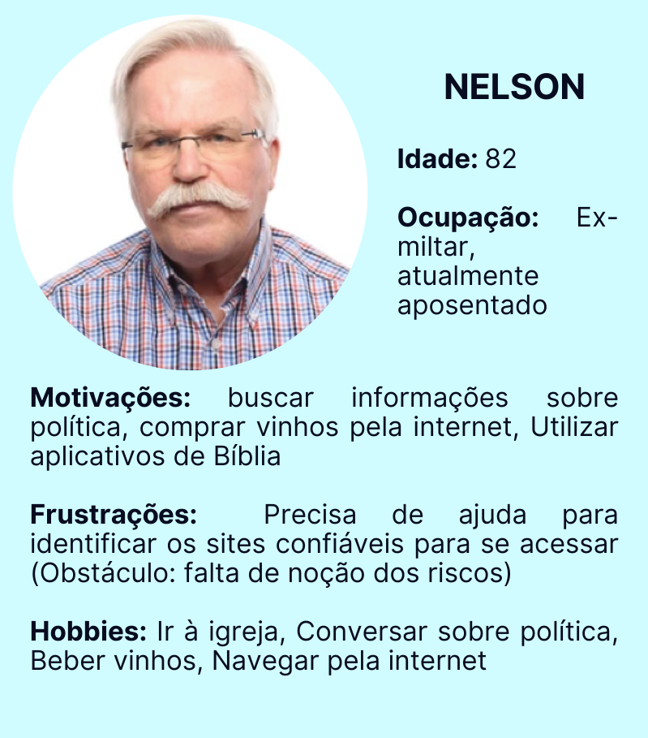
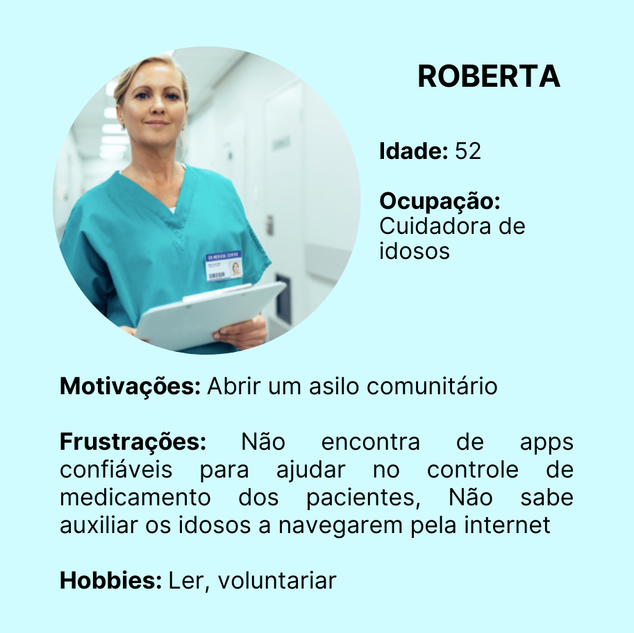
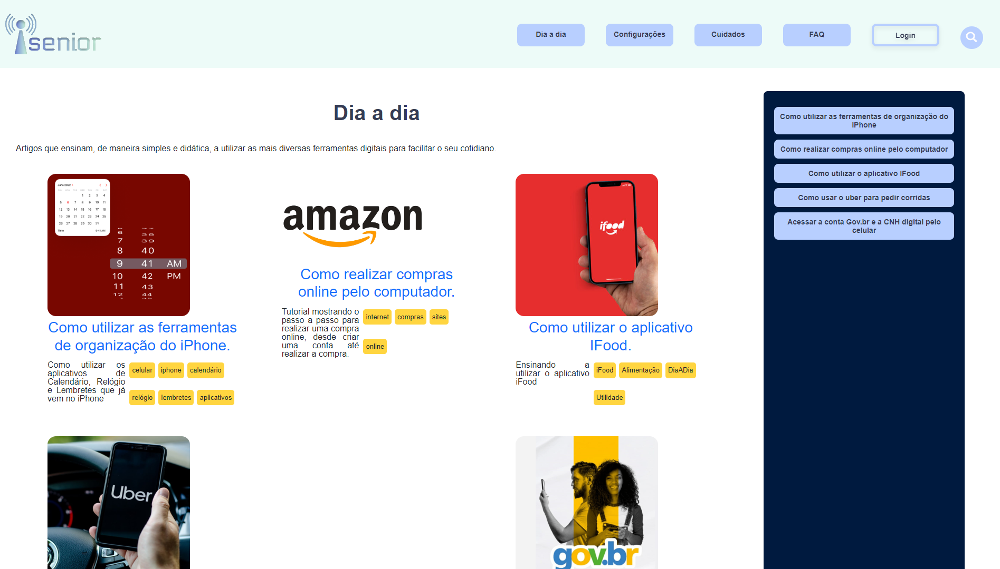
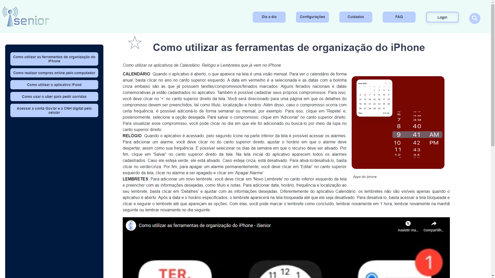
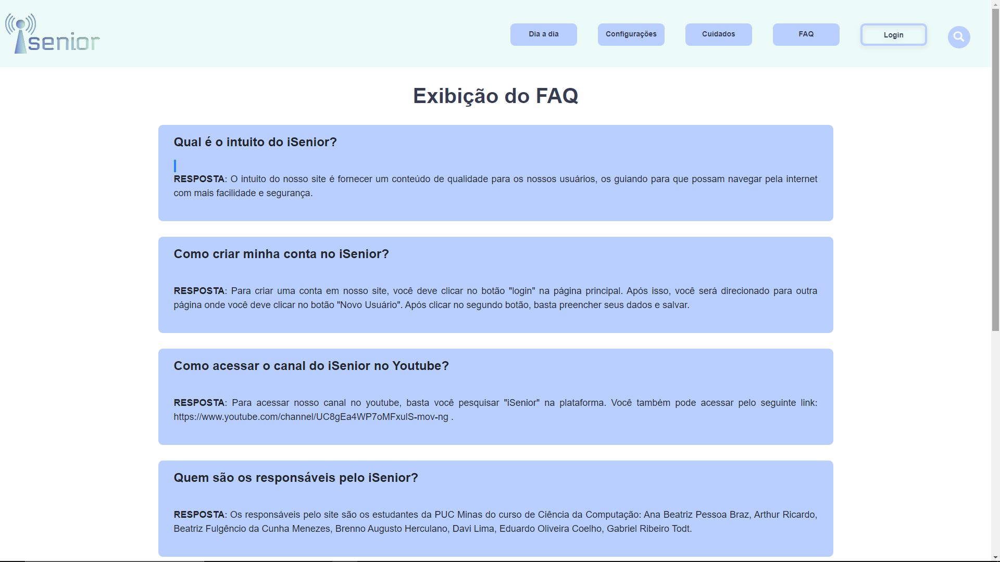
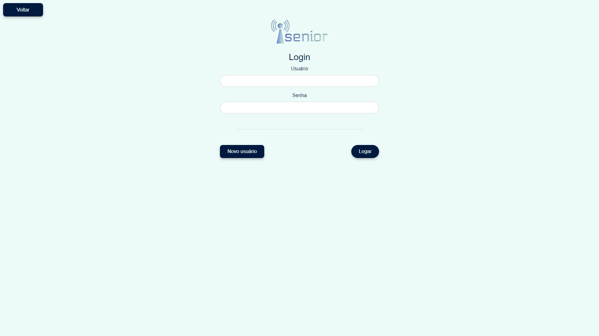
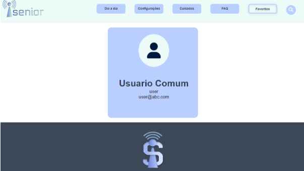
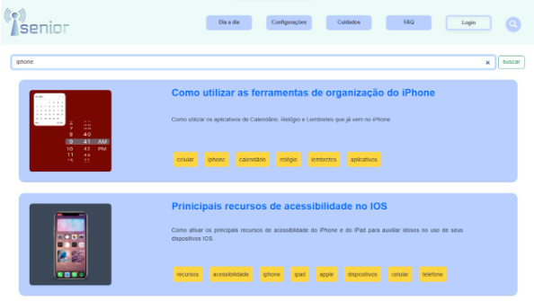
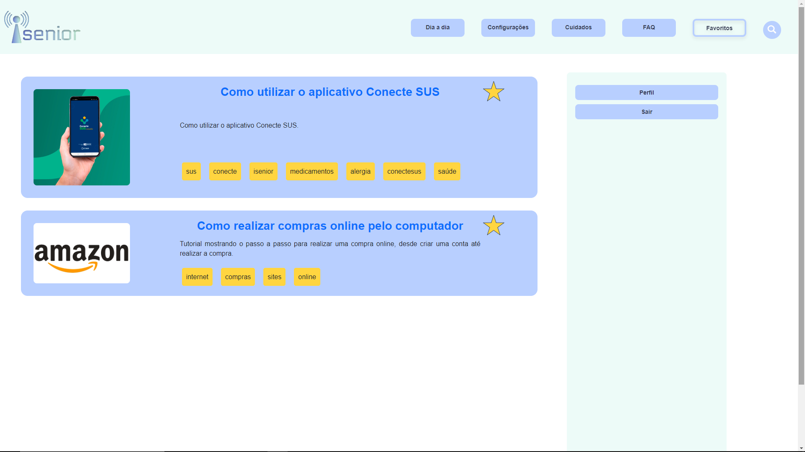

<h1 align="center" id="landing-page">iSenior</h1>

A cada dia que se passa, a utilização da internet tem se tornado mais necessária. Situações do dia a dia, como buscar informações, fazer compras ou se comunicar com os amigos e com a família são, nessa nova realidade, realizadas digitalmente. Entretanto, as pessoas com mais de 65 anos, as quais não foram acostumadas a utilizar os meios digitais com esses intuitos, sentem dificuldade ao serem imersas nesse contexto.
Diante disso, torna-se fundamental que existam ferramentas que auxiliem a terceira idade, de forma a ensinar esse grupo a lidar com os meios digitais tão usados na atualidade.

<h2>Participantes</h2>

<ul>
  <li>Artur Ricardo Martins Drummond Azevedo</li>
  <li>Ana Beatriz Pessoa Braz</li>
  <li>Brenno Augusto Herculano dos Santos</li>
  <li>Eduardo Oliveira Coelho</li>
  <li>Beatriz Fulgencio da Cunha Menezes</li>
  <li>Gabriel Ribeiro Todt Ferreira</li>
</ul>

# Estrutura do Documento

- [Informações do Projeto](#informações-do-projeto)
  - [Participantes](#participantes)
- [Estrutura do Documento](#estrutura-do-documento)
- [Introdução](#introdução)
  - [Problema](#problema)
  - [Objetivos](#objetivos)
  - [Justificativa](#justificativa)
  - [Público-Alvo](#público-alvo)
- [Especificações do Projeto](#especificações-do-projeto)
  - [Personas](#personas)
  - [Histórias de Usuários](#histórias-de-usuários)
  - [Requisitos](#requisitos)
    - [Requisitos Funcionais](#requisitos-funcionais)
    - [Requisitos não Funcionais](#requisitos-não-funcionais)
  - [Restrições](#restrições)
- [Metodologia](#metodologia)
  - [Divisão de Papéis](#divisão-de-papéis)
  - [Ferramentas](#ferramentas)
- [Projeto de Interface](#projeto-de-interface)
  - [User Flow](#user-flow)
  - [Wireframes](#wireframes)
- [Projeto da Solução](#projeto-da-solução)
  - [Tecnologias Utilizadas](#tecnologias-utilizadas)
    - [Tela - Home Page](#tela---home-page)
    - [Tela - Categorias](#tela---categorias)
    - [Tela - Exibição de Artigo](#tela---exibição-de-artigo)
    - [Tela - FAQ](#tela---faq)
    - [Tela - Login](#tela---login)
    - [Tela - Cadastro de Usuário](#tela---cadastro-de-usuário)
    - [Tela - Perfil](#tela---perfil)
    - [Tela - Administrador](#tela---administrador)
    - [Tela - Cadastro de Artigo](#tela---cadastro-de-artigo)
    - [Tela - Pesquisa](#tela---pesquisa)
    - [Tela - Favoritos](#tela---favoritos)
  - [Arquitetura da solução](#arquitetura-da-solução)
- [Hospedagem](#hospedagem)
- [Avaliação da Aplicação](#avaliação-da-aplicação)
  - [Plano de Testes](#plano-de-testes)
  - [Registros de Testes](#registros-de-testes)
- [Referências](#referências)

# Introdução

## Problema

O problema que se busca resolver com este projeto é a dificuldade que grande
parte dos idosos sente em acessar a internet com segurança e sabendo utilizar seus recursos e facilidades.

## Objetivos

O objetivo geral deste trabalho é a criação de um site informativo que sirva como um guia 
para que os idosos possam, com mais facilidade, navegar pela internet.
 
Como objetivos específicos, podemos ressaltar:

  - Fornecer funcionalidades que permitam maior acessibilidade dentro e fora do site.
  - Ensinar essas pessoas a identificar golpes e fake news.
  - Facilitar a execução de tarefas do dia a dia de idosos por meio da internet.
 

## Justificativa

Diferentemente das novas gerações que já nasceram com os recursos tecnológicos 
contidos no cotidiano, pessoas que nasceram em uma época na qual o acesso à tecnologia 
era mais restrito, antes da popularização da internet, encontram, hoje, dificuldades para se
adaptar a uma nova realidade tão digital. Esse novo cenário impõe aos mais velhos a
necessidade de se conectar à internet para contactar amigos e família, para trabalhar ou 
para acessar os artigos.

## Público-Alvo

O foco deste trabalho está nos idosos que sentem dificuldade em viver em um cenário tão tecnológico e digital. Sendo assim, o público alvo pode ser definido como a terceira idade, configurada por pessoas com mais de 65 anos, que buscam aprender a utilizar a internet e suas principais ferramentas de acessibilidade para facilitar as tarefas do dia a dia. Além disso, os cuidadores e as famílias têm papel fundamental no projeto, visto que poderão auxiliar o grupo em foco no primeiro contato com  a plataforma. 
 
# Especificações do Projeto

Foi feita uma pesquisa com idosos e cuidadores, a qual tinha como objetivo identificar os principais aspectos que motivam e que desmotivam os primeiros a utilizarem a internet e as dificuldades dos cuidadores de solucionar essa dificuldade. A partir dos resultados obtidos, foram elaboradas três personas, duas delas representando idosos e uma representando o cuidador.

## Personas

As personas levantadas durante o processo de entendimento do problema são apresentadas nas figuras que se seguem.

**Exemplo de Persona**

> 
> 
> 

## Histórias de Usuários

A partir da compreensão do dia a dia das personas identificadas para o projeto, foram registradas as seguintes histórias de usuários.

|EU COMO... `PERSONA`| QUERO/PRECISO ... `FUNCIONALIDADE` |PARA ... `MOTIVO/VALOR`                 |
|--------------------|------------------------------------|----------------------------------------|
|Marília  | saber utilizar com segurança as redes sociais           | manter contato com pessoas próximas               |
|Marília       | acessar blogs de culinária                 | aprender e compartilhar novas receitas |
|Marília       | saber fazer compras online                 | adquirir mais utensílios de cozinha e fazer compras de supermercado pelo celular |
|Nelson       | saber baixar aplicativos                 | acessar a Bíblia pelo celular |
|Nelson       | saber fazer compras online                  | preencher sua adega com vinhos de diversos tipos |
|Nelson       | saber utilizar com segurança as redes sociais                  | conhecer pessoas com as mesmas visões políticas que as suas |
|Roberta       | encontrar aplicativos de confiança                  | ajudá-la a controlar o horário dos remédios de cada paciente e a controlar suas obrigações |
|Roberta       | encontrar canais no Youtube sobre como realizar tarefas básicas digitalmente                  | auxiliar a ensinar para os idosos como navegar pela internet |

## Requisitos

O escopo funcional do projeto é definido por meio dos requisitos funcionais que descrevem as possibilidades de interação dos usuários, bem como os requisitos não funcionais que descrevem os aspectos que o sistema deverá apresentar de maneira geral. Estes requisitos são apresentados a seguir.

### Requisitos Funcionais
A tabela a seguir apresenta os requisitos do projeto, identificando a prioridade em que os mesmos devem ser entregues.

|ID    | Descrição do Requisito  | Prioridade |
|------|-----------------------------------------|----|
|RF-01| Cadastro de artigos | ALTA | 
|RF-02| Exibição de artigos  | ALTA |
|RF-03| Cadastro do FAQ  | BAIXA |
|RF-04| Exibição do FAQ  | BAIXA |
|RF-05| Cadastro do usuário  | MÉDIA |
|RF-06| Login  | MÉDIA |
|RF-07| Exibição do perfil  | BAIXA |
|RF-08| Página de pesquisa  | MÉDIA |
|RF-09| Exibição de artigos aleatórios  | BAIXA |
|RF-010| Página de Categoria  | MÉDIA |
|RF-011| Favoritar artigo  | MÉDIA |

### Requisitos não Funcionais

A tabela a seguir apresenta os requisitos não funcionais que o projeto deverá atender.

|ID     | Descrição do Requisito  |Prioridade |
|-------|-------------------------|----|
|RNF-01| Template | ALTA | 

## Restrições

As questões que limitam a execução desse projeto e que se configuram como obrigações claras para o desenvolvimento do projeto em questão são apresentadas na tabela a seguir.

|ID| Restrição                                             |
|--|-------------------------------------------------------|
|RE-01| O site deve ser desenvolvido com as habilidades adquiridas no primeiro semestre do curso |
|RE-02| O trabalho tem a data de entrega até o final do semestre        |

# Metodologia

A metodologia do processo se baseia na organização do grupo e nas ferramentas utilizadas para a realização do trabalho.

## Divisão de Papéis

| Aluno  | Função              |
|-----------|-------------------------|
| Ana Beatriz Braz  | Design & Organiza funções e horários |
| Artur Ricardo Martins Drummond Azevedo  | Front-End | 
| Beatriz Fulgencio da Cunha Menezes | Design & Organiza funções e horários |
| Brenno Augusto Herculano dos Santos | Cria novas features e ajuda no front-end |
| Eduardo Oliveira Coelho | Front-End |
| Gabriel Ribeiro Todt Ferreira | Front-End |

## Ferramentas

| Ambiente  | Plataforma              |Link de Acesso |
|-----------|-------------------------|---------------|
|Documentos do projeto  | Google Docs |  https://docs.google.com/document/d/1qgYBMHY91sYjbmvIANGuxynerLZylI9V24V_Agck1uE/edit?pli=1# | 
|Repositório de código fonte | GitHub | https://github.com/ICEI-PUC-Minas-PPLCC-TI/tiaw-ppl-cc-m-20221-t3-g7 | 
|Gerenciamento do Projeto | Trello |  https://trello.com/invite/b/y2NQIEZo/2b4fe119c04ffdc0287878d040b8b62a/sprint-1 | 
|Projeto de Interface e  Wireframes | Figma | https://www.figma.com/file/lQZHCFeZFqmCXMISXtrOEJ/Untitled?node-id=0%3A1  | 
|Design Thinking | Miro | https://miro.com/app/board/uXjVOBuUuE4=/  |

# Projeto de Interface

Foi desenvolvido um projeto de interface que facilita a acessibilidade dos idosos e dos cuidadores, com ferramentas e design de uso simples. O projeto tem uma identidade visual padronizada em todas as telas que são projetadas para funcionamento em desktops e dispositivos móveis.

## User Flow

O diagrama apresentado na Figura 2 mostra o fluxo de interação do usuário (user flow) pelas telas do sistema. Cada uma das telas deste fluxo é detalhada na seção de Wireframes que se segue.

> 

## Wireframes

Conforme fluxo de telas do projeto, apresentado no item anterior, as telas do sistema são apresentadas em detalhes nos itens que se seguem. As telas do sistema apresentam uma estrutura comum que é apresentada na Figura 3. Nesta estrutura, existem 3 grandes blocos, descritos a seguir. São eles:

> 
> 

# Projeto da Solução

Nesta seção são apresentados os detalhes técnicos da solução criada pelo grupo, tratando da Arquitetura da Solução, as estruturas de dados e as telas já implementadas.

## Tecnologias Utilizadas

Para implementar a solução, foram utilizadas as linguagens HTML, CSS e JavaScript. Além disso, serviços como GetBootstrap e Font Awesome também foram incluídos no projeto para facilitar a implementação do software.

### Tela - Home Page
A Home Page é a página inicial do site, onde mostra as informações principais do  nosso projeto como o nosso objetivo, nossas motivações, e quem nós somos. A página inicial possui um menu horizontal que está presente em todas as outras telas do site disponíveis para usuários. Quando o usuário realizar login, o botão "Login" será substituído pelo botão "Favoritos".

> 

### Tela - Categorias
A tela de categorias é uma tela que exibe todas os artigos de uma determinada categoria que foi selecionada pelo usuário clicando em um dos botões presentes no menu horizontal.

> 

### Tela - Exibição de Artigo
A tela de exibição de artigo é  uma tela que exibe um artigo específico que foi selecionado pelo usuário. Essa tela exibe todo o texto do artigo, uma thumbnail e um vídeo postado em nosso canal do youtube exemplificando o que está escrito no texto do artigo.

> 

### Tela - FAQ
A tela do FAQ é uma tela que exibe algumas perguntas comuns sobre a funcionalidade do site com respostas criadas por nós, criadores do site. 

> 

### Tela - Login
A tela de login é uma tela que aparece após o usuário clicar no botão "Login", presente no menu horizontal. Nessa tela, você possui a opção de entrar em uma conta existente, inserindo seu usuário e sua senha ou criar um novo usuário clicando no botão "Novo Usuário". Além disso, você pode clicar no botão "Voltar", e você será redirecionado para a tela inicial do site.

> 

### Tela - Cadastro de Usuário
A tela de cadastro de usuário é uma janela modal que aparece após o botão "Novo Usuário", da tela de login ser clicado. Essa janela modal pede para o usuário inserir algumas informações pessoais para que possa ser cadastrado em nosso site. Após inserir as informações, basta clicar no botão "Salvar" e realizar o login.

> 

### Tela - Perfil
A tela de perfil é onde as informações da conta do usuário são exibidas. Para acessar essa tela, o usuário deve, após realizar o login no site, clicar no botão "Favoritos" no menu horizontal e, depois de ser redirecionado para outra tela, deve clicar no botão "Perfil".

> 

### Tela - Administrador
A tela do administrador é uma tela disponível apenas para usuários administradores, que serve para que esses usuários possam realizar alterações no site como, por exemplo cadastrar um novo artigo ou uma nova pergunta e resposta do FAQ.

> 

### Tela - Cadastro de Artigo
A tela de cadastro de artigo é uma das telas disponíveis apenas para administradores. Essa tela serve para o administrador cadastrar um novo artigo no site, inserindo todas as informações que aparecem na tela de exibição de artigo.

> 

### Tela - Pesquisa
A tela de pesquisa disponibiliza a função de pesquisar por um assunto específico. Para acessar essa tela, basta clicar no ícone de lupa no menu horizontal do site.

> 

### Tela - Favoritos
A tela de favoritos exibe os artigos favoritos do usuário. Para favoritar uma notícia, basta o usuário clicar na estrela ao lado do título de um artigo quando este estiver selecionado e exibido. Para acessar a tela de favoritos, o usuário deve clicar no botão "Favoritos", do menu horizontal. 

> 

## Arquitetura da solução

A solução implementada conta com os seguintes módulos:
  1. **Navegador** - Interface básica do sistema 
     - **Páginas Web** - Conjunto de arquivos HTML, CSS, JavaScript e imagens que implementam as funcionalidades do sistema.
     - **Local Storage** - armazenamento mantido no Navegador, onde são implementados bancos de dados baseados em JSON. São eles: 
       - **Cadastro e Login** - informações do usuário para entrar na conta
       - **Cadastro de Artigo e do FAQ** - adicionar novas informações ao site
       - **Favoritos** - adicionar artigos favoritos ao perfil 
       - **Hospedagem** - local na Internet onde as páginas são mantidas e acessadas pelo navegador. 

> 

# Hospedagem
O site utiliza a plataforma do Repl.it como ambiente de hospedagem do projeto. O site é mantido no ambiente da URL: https://isenior.beatrizfulgenci.repl.co/index.html

# Avaliação da Aplicação

O processo de realização dos testes da solução desenvolvida está documentado na seção que se 
segue e traz os planos de testes de software e de usabilidade, na sequência, o registro dos
testes realizados.

Testes de Software:
* CT-01 - Visualizar artigos cadastrados
* CT-02 - Cadastro e exibição do FAQ
* CT-03 - Cadastro do novo usuário, login e exibição do perfil
* CT-04 - Página de pesquisa
* CT-05 - Página de favoritos

## Plano de Testes

O processo de realização dos testes da solução desenvolvida está documentado na seção que se
segue e traz os planos de testes de software e de usabilidade, na sequência, o registro dos
testes realizados.

Requisitos para realização do teste:
  * Site publicado na Internet
  * Navegador da Internet - Chrome, Firefox ou Edge

Os testes funcionais a serem realizados no aplicativo são descritos a seguir.

| Caso de Teste  | **CT-01 - Visualizar artigos cadastrados** |
|----------------|--------------------------------------------|
| Requisitos Associados  | **RF-01** - Cadastro de artigos.   **RF-02** - Exibição de artigos.   **RF-09** - Exibição de artigos aleatórios.   **RF-10** - Página de categoria. |
| Objetivos do teste  | Verificar se os artigos estão sendo devidamente adicionados nas páginas após o cadastro. | 
| Passos |  **1.** Acessar a página principal do site.   **2.** Logar na conta de administrador (admin, 123).   **3.** Clicar no botão “ADMTESTE”.   **4.** Clicar no botão “Cadastrar artigo”.   **5.** Fazer o cadastro de um novo artigo, preenchendo os campos pedidos na página.   **6.** Voltar para a página inicial do site.   **7.** Verificar se o novo artigo está sendo exibido entre os artigos aleatórios.   **8.** Abrir a página da categoria do novo artigo.   **9.** Verificar se o novo artigo está presente na página da categoria selecionada.   **10.** Clicar no novo artigo.   **11.** Verificar se o novo artigo foi aberto em uma página, sendo unicamente exibida, com vídeo, imagem e texto.   |
| Critérios de Êxito | As páginas de exibição de artigo devem exibir o novo artigo criado através do cadastro, contendo todas as informações inseridas. |

| Caso de Teste  | **CT-02 - Cadastro e Exibição do FAQ** |
|----------------|----------------------------------------|
| Requisitos Associados  | **RF-03** - Cadastro do FAQ.   **RF-04** - Exibição do FAQ. |
| Objetivos do teste  | Verificar se as perguntas e respostas cadastradas são adicionadas à página do FAQ. O cadastro só deve ser possível caso o usuário logado seja um administrador. | 
| Passos |  **1.** Entre na página inicial do site.   **2.** Clique em “Login” no menu horizontal.   **3.** Logue com o usuário “admin” e a senha “123”.   **4.** Clique em “ADMTESTE”.   **5.** Clique em “Cadastro do FAQ”.   **6.** Preencha a nova pergunta e a nova resposta.   **7.** Entre na página inicial do site.   **8.** Clique em “FAQ” no menu horizontal. |
| Critérios de Êxito | A página do administrador deve exibir o cadastro da pergunta e da resposta e o botão de inserir. Além disso, tanto para o administrador quanto para o usuário, devem aparecer na página de FAQ todas as perguntas e respostas cadastradas. |

| Caso de Teste  | **CT-03 - Cadastro do novo usuário, login e exibição do perfil** |
|----------------|------------------------------------------------------------------|
| Requisitos Associados  | **RF-05** - Cadastro de usuário.   **RF-06** - Login.   **RF-07** - Exibição do perfil. |
| Objetivos do teste  | Verificar se o usuário cadastrado consegue logar no site e, posteriormente, acessar suas informações cadastrais. | 
| Passos |  **1.** Entre na página inicial do site.   **2.** Clique em “Login” no menu horizontal.   **3.** Clique em “Novo Usuário”.   **4.** Preencha os dados cadastrais.   **5.** Clique em “Salvar”.   **6.** Clique em “Login” no menu horizontal.   **7.** Preencha as informações de login.   **8.** Clique em “Favoritos” no menu horizontal.   **9.** Clique em “Perfil” na barra lateral. |
| Critérios de Êxito | Ao acessar a conta cadastrada e clicar no perfil, devem ser exibidas algumas das informações cadastrais, como nome completo, nome de usuário e e-mail. |

| Caso de Teste  | **CT-04 - Página de pesquisa** |
|----------------|--------------------------------|
| Requisitos Associados  | **RF-08** -  Página de pesquisa. |
| Objetivos do teste  | Verificar se as palavras-chave pesquisadas na barra de pesquisa retornam os resultados devidos. | 
| Passos |  **1.** Entre na página inicial do site.   **2.** Clique no ícone de lupa no menu horizontal.   **3.** Digite algo que deseja pesquisar. |
| Critérios de Êxito | O resultado da pesquisa deve ser compatível com o que foi buscado. Por exemplo, se for digitado “android” devem aparecer na tela apenas artigos relacionados a esse tema. |

| Caso de Teste  | **CT-05 - Página de Favoritos** |
|----------------|---------------------------------|
| Requisitos Associados  | **RF-11** -  Página de favoritos. |
| Objetivos do teste  | Verificar se os artigos favoritados pelo usuário logado são exibidos na página de favoritos. | 
| Passos |  **1.** Entre na página inicial do site.   **2.** Clique em “Login” no menu horizontal.   **3.** Logue na sua conta.   **4.** Clique em algum artigo.   **5.** Favorite esse artigo clicando na estrela.   **6.** Clique em “Favoritos” no menu horizontal.|
| Critérios de Êxito | O artigo exibido na tela de favoritos deve ser o mesmo que foi favoritado. |

## Registros de Testes

Os testes obtiveram resultados satisfatórios, visto que os idosos que acessaram o site leram os artigos e assistiram aos vídeos e relataram ter tido maior facilidade em acessar os recursos e as ferramentas digitais que foram trabalhadas no projeto. Entretanto, alguns relatos mostram, também, pontos fracos da solução, como a impossibilidade de fazer sugestões e perguntas sobre os artigos, devido à inexistência de um campo de comentários. Essas funcionalidades deverão ser implementadas nas próximas iterações. Ademais, algumas das sugestões retornadas pelos testes foram implementadas no sistema, como a criação de um FAQ.

# Referências

A lista a seguir traz as referências utilizadas nesse trabalho:

Já conhece os recursos de acessibilidade digital da EqualWeb e a função de cada um deles? - 2019. https://equalweb.com.br/recursos-de-acessibilidade-digital-da-equalweb-e-a-funcao-de-cada-um-deles/ - Acessado em: 01/04/2022

PRODEST - Programa Melhor Idades. 2019. https://prodest.es.gov.br/programa-melhor-idade - Acessado em: 01/04/2022
